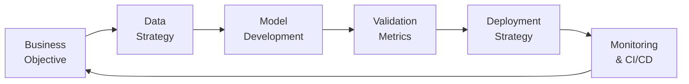
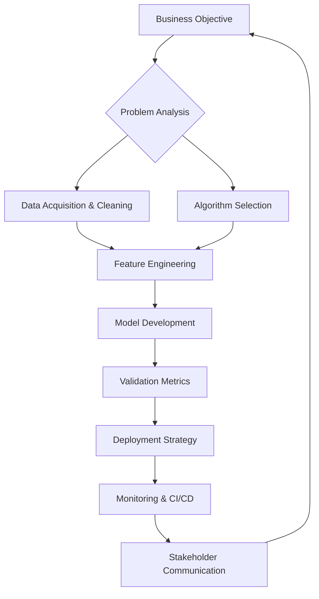

<!-- DYNAMIC HEADER -->
<p align="center">
  
</p>
<p align="center">
  <a href="https://git.io/typing-svg">
    
  </a>
</p>

<!-- TECHNICAL SKILLS -->
## ⚙️ Technical Arsenal
<div align="center">

### 💻 Programming & Core


### 📊 Data Science


### 🤖 AI/ML Specialization


### 🧠 ML Frameworks


### ☁️ AWS Ecosystem


### 🚀 Deployment & Tools


</div>

<!-- PROBLEM-SOLVING FRAMEWORK -->
## 🧠 Problem-Solving Framework

Cognitive Principles
<table align="center"> <tr> <td align="center" width="200"> <br> <b>Deconstruct Problems</b><br> <sub>Break complex issues to fundamentals</sub> </td> <td align="center" width="200"> <br> <b>Test Early & Often</b><br> <sub>Build testability from day one</sub> </td> <td align="center" width="200"> <br> <b>Full Ownership</b><br> <sub>From prototype to production</sub> </td> </tr> </table>
ML Lifecycle Approach
Phase	Key Focus	Tools
Data Strategy	Quality > Quantity	Pandas, SQL, Great Expectations
Model Development	Accuracy vs Speed	Scikit-learn, TensorFlow, Optuna
Validation	Robust Metrics	MLflow, Evidently AI
Deployment	Scalable Serving	Docker, FastAPI, AWS EC2
Monitoring	Continuous Improvement	Prometheus, Grafana, Drift Detection
<!-- PROJECT SHOWCASE -->
🚀 Impact Projects
1. Customer Segmentation with Credit Card Insights
https://img.shields.io/badge/Code-181717?logo=github
https://img.shields.io/badge/Live_Demo-FF4B4B?logo=streamlit
https://img.shields.io/badge/Clusters-4-blue
https://img.shields.io/badge/ROI+25%2525-brightgreen

K-Means, DBSCAN, PCA, Streamlit, Plotly

Clustered 8.9k users achieving 0.7 silhouette score

Identified 4 customer personas for targeted marketing

Built interactive Streamlit dashboard with 3D visuals

Drove 25%↑ campaign ROI and 18%↑ retention

2. Credit Default Prediction System
https://img.shields.io/badge/Code-181717?logo=github
https://img.shields.io/badge/Report-4285F4?logo=google-drive
https://img.shields.io/badge/ROC_AUC-91%2525-success
https://img.shields.io/badge/Time_Reduction-80%2525-critical

XGBoost, SHAP, FastAPI, Docker, AWS

Built end-to-end credit risk pipeline with 91% ROC-AUC

Integrated SHAP for explainable loan decisions

Containerized solution on AWS (EC2, S3, ECR)

Reduced evaluation time by 80% with 25%↑ accuracy

3. ML Phishing Detector
https://img.shields.io/badge/Code-181717?logo=github
https://img.shields.io/badge/Report-4285F4?logo=google-drive
https://img.shields.io/badge/Precision-94%2525-brightgreen
https://img.shields.io/badge/Drift_Detection-Implemented-yellow

MongoDB, MLflow, DAGsHub, GitHub Actions, AWS

Designed pipeline with MongoDB ingestion and drift detection

Benchmarked 5 ML models achieving 94% precision/recall

Enabled team collaboration via MLflow + DAGsHub

Deployed real-time inference on AWS with CI/CD

4. SpellSeqAI - DL Spelling Corrector
https://img.shields.io/badge/Code-181717?logo=github
https://img.shields.io/badge/Report-4285F4?logo=google-drive
https://img.shields.io/badge/Accuracy-90%2525+-success
https://img.shields.io/badge/F1_Score-90%2525+-blue

LSTM, DVC, MLflow, Docker, Flask, AWS

Developed custom LSTM Seq2Seq model for spelling correction

Managed reproducibility with DVC and MLflow

Deployed on AWS using Flask API + Docker

Achieved 90%+ accuracy for chatbots and typing tools

<!-- BUSINESS IMPACT -->
💼 Business Value Delivered
Project	Industry	Technical Solution	Business Impact
Customer Segmentation	FinTech	K-Means/DBSCAN clustering	25%↑ campaign ROI, 18%↑ retention
Credit Default Prediction	Banking	XGBoost + SHAP explainability	80%↓ evaluation time, 25%↑ accuracy
Phishing Detector	Cybersecurity	Ensemble ML + Drift detection	94% precision, Real-time protection
SpellSeqAI	SaaS	LSTM Seq2Seq model	90%+ accuracy for productivity tools
<!-- GITHUB STATS -->
📊 Development Activity
Diagram
Code
pie showData
    title Weekly Focus Areas
    “ML Development” : 40
    “Deployment” : 30
    “Data Engineering” : 20
    “Documentation” : 10
<p align="center">   </p><!-- CONTACT -->
✨ Let's Connect
"Building solutions at the intersection of data, technology, and business impact"

<p align="center"> <a href="mailto:afrozali3001.aa@gmail.com">  </a> <a href="https://www.linkedin.com/in/yourprofile">  </a> <a href="https://mohd-afroz-ali.github.io">  </a> <a href="https://github.com/mohd-afroz-ali">  </a> </p> ```

<!-- DYNAMIC HEADER SECTION -->
<p align="center">
  
</p>

<p align="center">
  <a href="https://git.io/typing-svg">
    
  </a>
</p>

<div align="center">

### 💻 Programming & Core


### 📊 Data Science


### 🤖 AI/ML Specialization


### 🧠 ML Frameworks


### ☁️ AWS Ecosystem


### 🚀 Deployment & Tools


</div>




<!-- Profile Header -->
<h1 align="center">Hi 👋, I'm Mohammad Afroz Ali</h1>
<h3 align="center">🚀 Aspiring AI/ML Engineer | Java Dev | Problem Solver</h3>

<p align="center">
  
</p>

---

### 👨‍💻 About Me:
- 🎓 Final Year IT Engineering Student at MJ College, Osmania University  
- 💡 I enjoy solving real-world problems using AI and ML  
- 🧠 Currently working on: `AI  Tools` + ` ML Projects`  
- 🌱 Learning: LangChain, HuggingFace, Prompt Engineering 
- 📫 How to reach me: afrozali3001.aa@gmail.com  
- 🌐 portfolio website: https://mohd-afroz-ali.github.io/

---

### 💼 Tech Stack:
<p align="left">
  
  
  
  
  
  
  
</p>


### 📜 Certifications:
- ✅ ML, NLP & DL Course – *Krish Naik (Udemy)*  
- ✅ Generative AI Course – *Krish Naik*  
- ✅ Java Full Stack – *Wipro TalentNext*  
- ✅ AWS Certified Solutions Architect  
- ✅ HackerRank Problem Solving Certificate  

---

---

📌 **Featured Projects**

- [🧠 GenAI Chatbot using LangChain & RAG](#)  
- [📄 Text Summarizer using BART Transformers](#)  
- [🔁 MLOps Pipeline for Model Deployment](#)  
- [📊 NLP-based Twitter Sentiment Dashboard](#)  

---


### 🌐 Let's Connect:
[](https://linkedin.com/in/mohd-afroz-ali)  
[](mailto:afrozali3001.aa@gmail.com)

---

⭐ _“Learn daily, Build daily, Share daily”_
