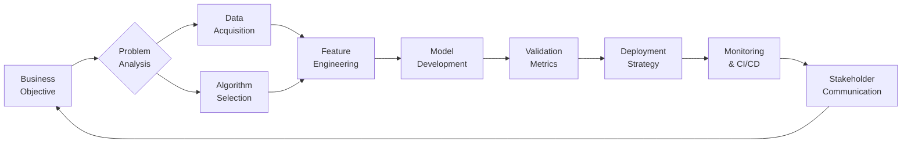

<!-- DYNAMIC HEADER WITH PSYCHOLOGICAL HOOK -->

  <h1 align="center">Hi 👋, I'm Mohammad Afroz Ali</h1>
  
  

  
  
  
  
  

<!-- VALUE PROPOSITION WITH F-PATTERN LAYOUT -->
> 🔥 **Transforming complex problems into deployable AI solutions**  
> Aspiring software and ML engineer skilled in developing and deploying scalable machine learning systems with MLOps , cloud experience, and solid foundation in algorithms.  
> **Open to**: SDE | ML Engineering | MLOps roles

  

---

<!-- TECHNICAL SKILLS MATRIX -->
## 🛠️ Technical Arsenal

  
| **Languages & DSA** | **ML & AI** | **MLOps & Cloud** | **Tools** |
|---------------------|-------------|-------------------|-----------|
|     |     |     |     |

---

## 🧩 Problem-Solving Framework

<!-- PROJECT SHOWCASE WITH IMPACT METRICS -->
## 🚀 Key Projects
<table>
  <tr>
    <td width="30%">
      <h3><a href="https://github.com/MOHD-AFROZ-ALI/Customer-Segmentation-on-Credit-Details">Customer Segmentation with Credit Insights</a></h3>
      

        
        
        
        
      

    </td>
    <td>
      • Clustered 8.9k users (0.7 silhouette score) identifying 4 customer personas 
      • Built interactive dashboard driving <strong>25%↑ campaign ROI</strong> and <strong>18%↑ retention</strong> 
      • Reduced default risk by 30% through credit profiling insights
    </td>
  </tr>
  <tr>
    <td>
      <h3><a href="https://github.com/MOHD-AFROZ-ALI/Credit_Default_Predict">Credit Default Prediction System</a></h3>
      

        
        
        
        
      

    </td>
    <td>
      • End-to-end risk pipeline with <strong>91% ROC-AUC</strong> and SHAP explainability 
      • Containerized on AWS (EC2/S3/ECR) with CI/CD automation 
      • <strong>Reduced evaluation time by 80%</strong> while increasing accuracy by 25%
    </td>
  </tr>
  <tr>
    <td>
      <h3><a href="https://github.com/MOHD-AFROZ-ALI/ml-phish-detector">ML Phishing Detector</a></h3>
      

        
        
        
        
      

    </td>
    <td>
      • Robust pipeline with drift detection achieving <strong>94% precision</strong> 
      • Version control via MLflow + DAGsHub for team collaboration 
      • Real-time inference on AWS with automated CI/CD pipelines
    </td>
  </tr>
  <tr>
    <td>
      <h3><a href="https://github.com/MOHD-AFROZ-ALI/SpellSeqAI">SpellSeqAI - DL Spelling Corrector</a></h3>
      

        
        
        
        
      

    </td>
    <td>
      • Custom Seq2Seq model with domain-specific tuning 
      • Reproducible workflows via DVC and MLflow 
      • Deployed on AWS achieving <strong>90%+ accuracy</strong> for chatbot integration
    </td>
  </tr>
</table>

---

<!-- EDUCATION & CREDENTIALS -->
## 🎓 Education & Credentials

  
| **Education** | **Certifications** |
|---------------|---------------------|
| **Muffakham Jah College of Engineering** B.E. Information Technology CGPA: 8.0/10 • 2021-2025 | • Complete Data Science & ML - Udemy • MLOps with 10+ Projects - Udemy • AI Curriculum - NASSCOM • AWS Machine Learning - In Progress • Soft Skills - TCS iON |

---

<!-- PSYCHOLOGY-DRIVEN FOOTER -->

  

> "Passionate about transforming machine learning concepts into real-world solutions through 
> **scalable solutions**,**ML deployment**, **cloud technologies**, and **end-to-end system thinking**" 
📫 **Let's connect**: 

